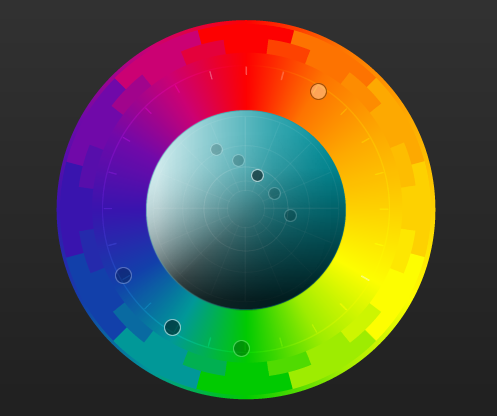

# Colors

We stick to the [color palette provided by TailwindCSS](https://tailwindcss.com/docs/customizing-colors), and don't define our own RGB values.

Within that framework, we stick to three adjacent colors on a color wheel (`blue`, `teal`, and `lime`) and one complementary color (`orange`). We use `slate` when a neutral color is required. Any of the values (50-900) can be used within those colors.

### Basic rules

These could be subject to change as we learn more about what works well and looks good.

1. Use `blue` for primary and call-to-action _interactive_ elements (like buttons).
2. Use `teal` for primary _non-interactive_ elements (like cards).
3. Use `lime` for indications of "success" or interactive elements that indicate positive intent.
4. Use `orange` (especially darker shades) for "warning" or "danger" elements (buttons, errors).
5. Use `slate` for things that shouldn't draw any particular attention (e.g. background and regular text).

### On a color wheel

While it doesn't exactly match the Tailwind colors, you can use paletton.com to see [a good visualization](https://paletton.com/#uid=63k0u0knNtaejGjjxwfsmpuuGkb) of how our colorscheme looks on the color wheel:

