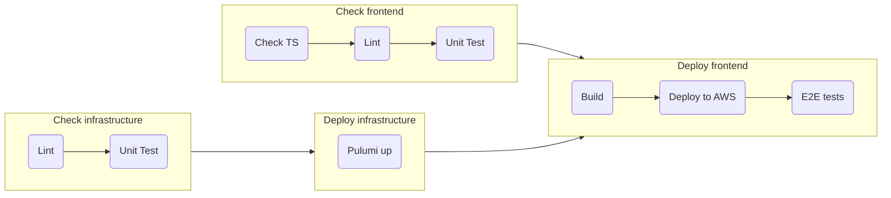

This page describes our build and deploy workflow:

## Pull Requests

When you open or push commits to a pull request, the app will be checked, built and deployed to:

[agile-poker-qa.superfun.link](https://agile-poker-qa.superfun.link).

E2E tests will be run against that URL.

## Merges to main

When you merge into `main`, the app will be checked, built and deployed to:

[agile-poker.superfun.link](https://agile-poker.superfun.link).

E2E tests will **not** be run against that URL.

**NOTE: That means that when you merge, your change goes to "prod" automatically.**

## Build and deploy flowchart

If the flowchart below does not render, then GitHub pages doesn't support [Mermaid](https://mermaid-js.github.io/) syntax on GitHub pages yet. Maybe someday they will. Otherwise `.github/workflows/ci.yml` is always the canonical source for how the build and deploy works.

